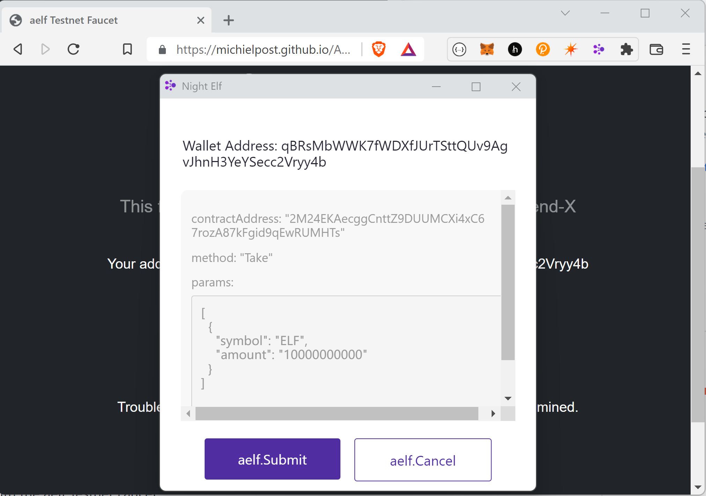

# aelf Testnet Faucet
  
Application to interact with the aelf Testnet Faucet

Go to the faucet: **[Live Version](https://michielpost.github.io/AElfFaucet/)**

This project was created for the [aelf Legend-X Hackathon](https://aelf.devpost.com).

## How to use

The faucet makes it easy to get testnet tokens for the aelf testnet:
- Install the [Night Elf Extension](https://chrome.google.com/webstore/detail/aelf-explorer-extension-d/mlmlhipeonlflbcclinpbmcjdnpnmkpf)
- Go to the faucet: https://michielpost.github.io/AElfFaucet/
- Click on `Connect Wallet`
- View your address and current balance
- Click on `Get ELF from faucet!`
- View the transaction on the explorer, once it's minded:
- Click on `Refresh Balance`
- View your new ELF balance

## Video
https://vimeo.com/manage/videos/711976849

## Screenshots
Use the testnet faucet

Submit the transaction

100 ELF added

## Refrences
- https://github.com/AElfProject/aelf-community/blob/main/shares/take-elf-tokens-from-test-net.md
